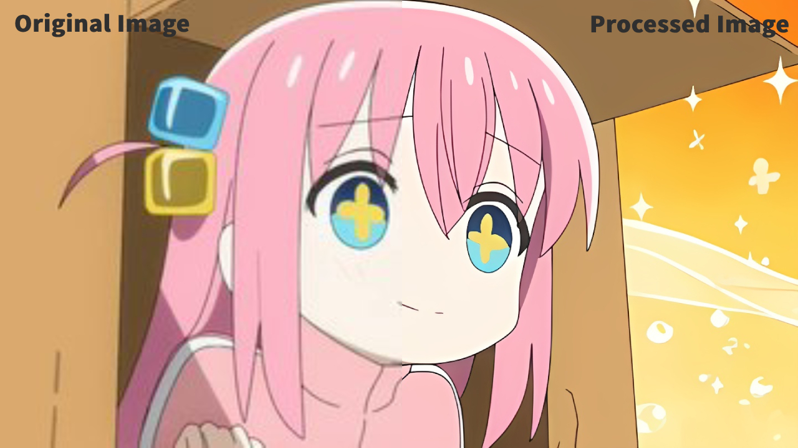

# Image Boost Model

Image Boost aims at encapsulating the function of [Real-ESRGAN](https://github.com/xinntao/Real-ESRGAN) with a simple function to facilitate the application of the model

---

## Demos

*Original Image Info:* 360 $\times$ 203, 15.7 KB
*Oricessed Image Info:* 1440 $\times$ 812, 205.2 KB
<p align="center">
    
</p>

---

## How To Use

#### Environment
- Python >= 3.7
- PyTorch >= 1.7

#### Installation
*Here we using Python 3.9 and PyTorch 2.0.1 in Windows 10 as an example*
1. Create environment (Recommend to use [Anaconda](https://www.anaconda.com/))
   ```bash
   conda create -n image_boost python=3.9
   ```
2. Clone repo
   ```bash
   git clone https://github.com/sumail25/ImageBoostModel.git
   cd ImageBoostModel
   ```

4. Install Pytorch and other dependent packages
   ```bash
   # Here we choose CUDA 11.8 as compute platform
   pip3 install torch torchvision torchaudio --index-url https://download.pytorch.org/whl/cu118
   # Other requirements
   pip install -r requirements.txt

   # Or you can install them manually to ensure dependencies
   pip install basicsr
   pip install facexlib
   pip install gfpgan
   pip install realesrgan
   ```

#### Inference

You can use X4 model for **arbitrary output size** with the argument `outscale`. The program will further perform cheap resize operation after the Real-ESRGAN output.

```console
Usage: python image_boost.py -n RealESRGAN_x4plus -i input_file_or_folder -o output [options]...
  -h                   show this help
  -i --input           Input image or folder. Default: inputs
  -o --output          Output folder. Default: results
  -n --model_name      Model name. Default: RealESRGAN_x4plus
  -s, --outscale       The final upsampling scale of the image. Default: 4
  --suffix             Suffix of the restored image. Default: out
  -t, --tile           Tile size, 0 for no tile during testing. Default: 0 (Save CUDA memory. Try 100 first)
  --face_enhance       Whether to use GFPGAN to enhance face. Default: False
  --fp32               Use fp32 precision during inference. Default: fp16 (half precision).
  --ext                Image extension. Options: auto | jpg | png, auto means using the same extension as inputs. Default: auto
```
0. You could download pre-trained models manually to **weights** folder: [Real-ESRGAN_x4plus.pth](https://github.com/xinntao/Real-ESRGAN/releases/download/v0.1.0/RealESRGAN_x4plus.pth), [Real-ESRGAN_x4plus_anime_6B.pth](https://github.com/xinntao/Real-ESRGAN/releases/download/v0.2.2.4/RealESRGAN_x4plus_anime_6B.pth).
1. Inference.
   ```bash
   # General images
   # if you use --face_enhance, it will download models in gfpgan folder for face enhance.
   python image_boost.py -n RealESRGAN_x4plus -i inputs --face_enhance

   # Anime images
   python image_boost.py -n RealESRGAN_x4plus_anime_6B -i inputs
   ```
3. Processed images are in `outputs` folder.

#### TODO
...function used to call

---


### Misc
Thanks again for [Real-ESRGAN](https://github.com/xinntao/Real-ESRGAN).

You can learn more from: **Paper: Real-ESRGAN: Training Real-World Blind Super-Resolution with Pure Synthetic Data**

> [[Paper](https://arxiv.org/abs/2107.10833)] &emsp; [[YouTube Video](https://www.youtube.com/watch?v=fxHWoDSSvSc)] &emsp; [[B站讲解](https://www.bilibili.com/video/BV1H34y1m7sS/)] &emsp; [[Poster](https://xinntao.github.io/projects/RealESRGAN_src/RealESRGAN_poster.pdf)] &emsp; [[PPT slides](https://docs.google.com/presentation/d/1QtW6Iy8rm8rGLsJ0Ldti6kP-7Qyzy6XL/edit?usp=sharing&ouid=109799856763657548160&rtpof=true&sd=true)]
> [Xintao Wang](https://xinntao.github.io/), Liangbin Xie, [Chao Dong](https://scholar.google.com.hk/citations?user=OSDCB0UAAAAJ), [Ying Shan](https://scholar.google.com/citations?user=4oXBp9UAAAAJ&hl=en)
> [Tencent ARC Lab](https://arc.tencent.com/en/ai-demos/imgRestore); Shenzhen Institutes of Advanced Technology, Chinese Academy of Sciences

<p align="center">
  
</p>

---